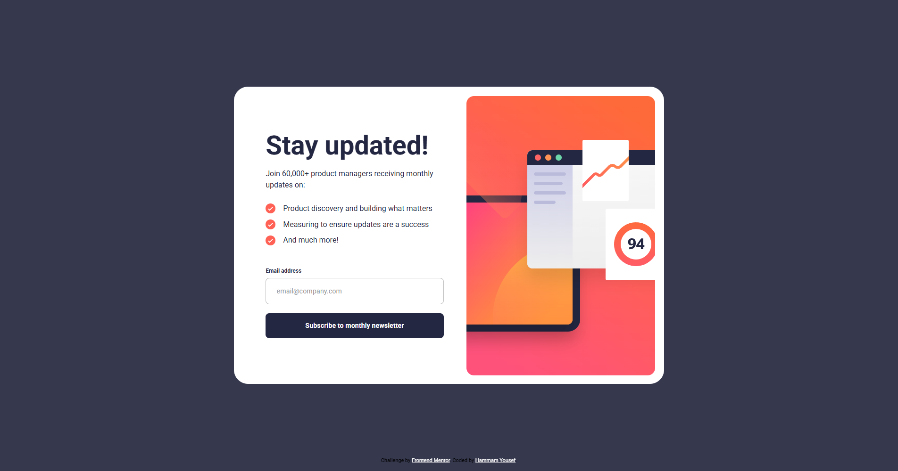
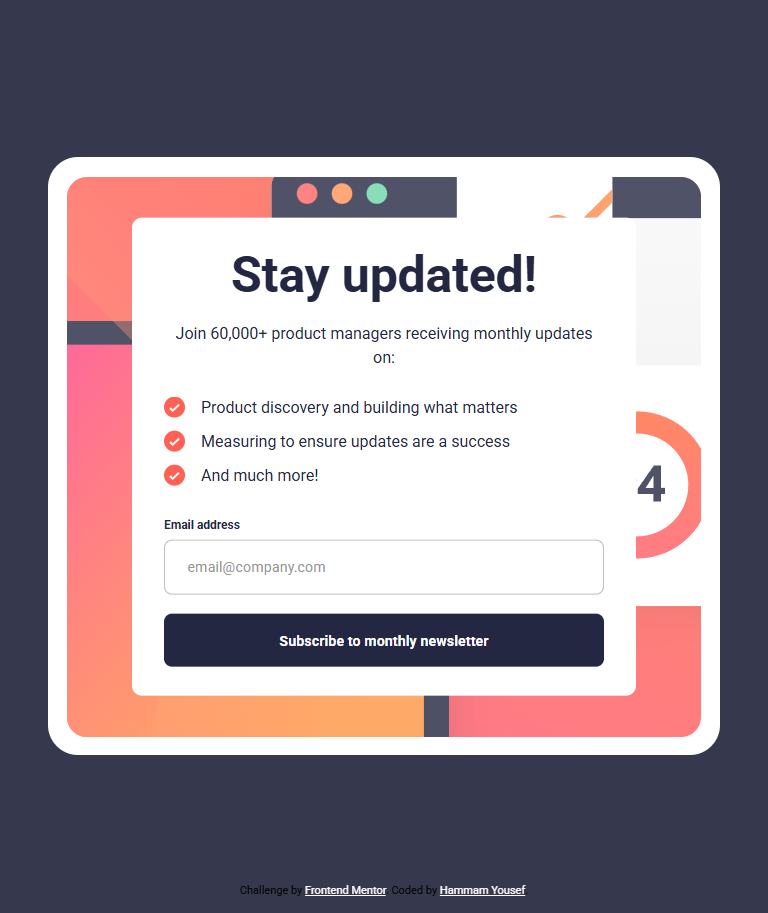
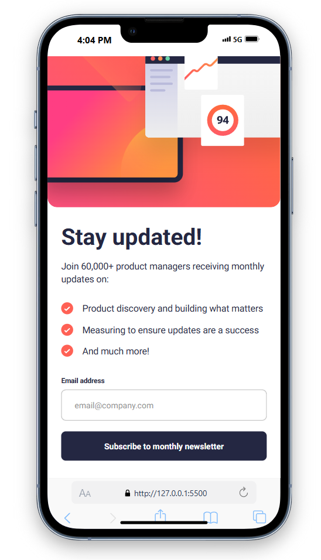

# Frontend Mentor - Newsletter sign-up form with success message solution

This is a solution to the [Newsletter sign-up form with success message challenge on Frontend Mentor](https://www.frontendmentor.io/challenges/newsletter-signup-form-with-success-message-3FC1AZbNrv).

## Table of contents

- [Overview](#overview)
  - [The challenge](#the-challenge)
  - [Screenshot](#screenshot)
  - [Links](#links)
- [My process](#my-process)
  - [Built with](#built-with)
  - [What I learned](#what-i-learned)
- [Author](#author)

## Overview

### The challenge

Users should be able to:

- Add their email and submit the form
- See a success message with their email after successfully submitting the form
- See form validation messages if:
  - The field is left empty
  - The email address is not formatted correctly
- View the optimal layout for the interface depending on their device's screen size
- See hover and focus states for all interactive elements on the page

### Screenshot

### Links

- Solution URL: <!-- Add your solution URL here -->
- Live Site URL: <!-- Add your live site URL here -->

## My process

### Built with

- Semantic HTML5 markup ([index.html](index.html))
- CSS custom properties, Flexbox, and responsive design ([style.css](style.css))
- Vanilla JavaScript for form validation and UI transitions ([main.js](main.js))
- [animate.css](https://animate.style/) for animations

### What I learned

- How to implement custom form validation and error handling in vanilla JavaScript ([main.js](main.js))
- Responsive design using CSS media queries ([style.css](style.css))
- Using Animate.css for smooth UI transitions
- Managing UI state (show/hide cards) without frameworks

## Author

- Frontend Mentor - [@HammamYousef](https://www.frontendmentor.io/profile/HammamYousef)
